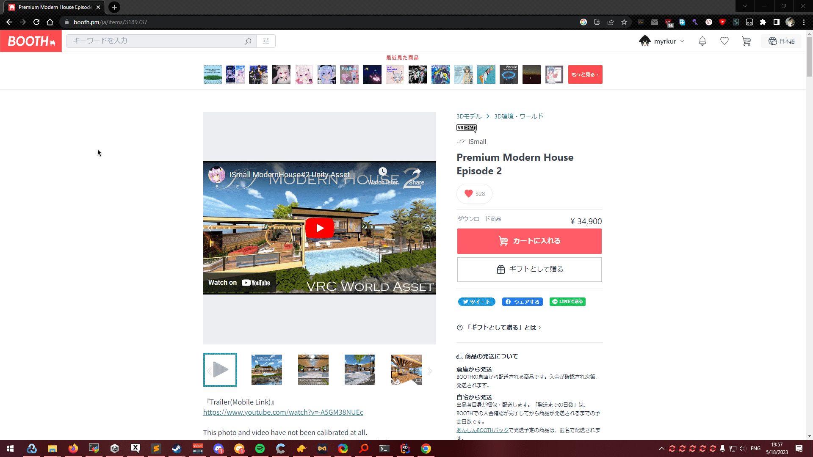
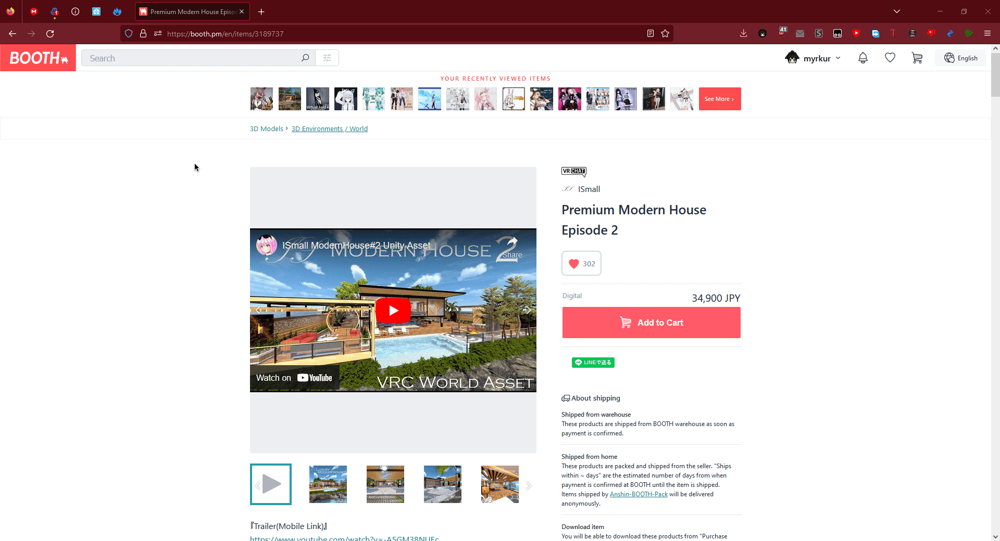

# BoothDownloader
Downloads all images and free files from a booth item's gallery.

https://booth.pm/

# Use
> sign into booth and grab your accounts Cookie called `_plaza_session_nktz7u` and provide this to the console app or paste into generated BDConfig.json File
>
> paste URL or ID of item into program console.
> 
> or paste the orders page `https://accounts.booth.pm/orders` to download all orders
> 

Usable format:
> https://booth.pm/en/items/3807513
> 
> https://harukappumen.booth.pm/items/3807513
>
> 3807513

follow these video's to get your access token, this is required for downloading free files.

# Chrome


# Firefox


# example config #
```json
{
  "Cookie": "~Token Goes Here~",
  "FirstBoot": false,
  "Auto_Zip": true
}
```
