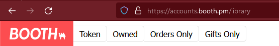

# BoothDownloader
Downloads all images, free and paid files you own from a booth item's gallery.

https://booth.pm/

# Use
> paste URL or ID of item into program console, or use the download button added by the user script.
> 
> or paste the [orders](https://accounts.booth.pm/orders) / [gifts](https://accounts.booth.pm/library/gifts) page to download all orders or gifted items.
> 

Usable format:
> https://booth.pm/en/items/3807513
> 
> https://harukappumen.booth.pm/items/3807513
>
> 3807513
> 
> gifts
> 
> orders

follow these video's or the automatic setup to get your access token, this is required for downloading free items and any items you have paid for.

# Automatic setup
1. download latest BoothDownloader from [releases](https://github.com/Myrkie/BoothDownloader/releases) V10.0.0 and up required
2. place BoothDownloader in a preferred location and open up a terminal in the path and run `--register` to register the windows url handler
3. install the [tampermonkey BETA browser extension](https://www.tampermonkey.net/) (__BETA IS REQUIRED__)
4. install the script in repo directory [BoothDownloader URL Handler](BoothDownloader%2Fsrc%2FTamperMonkey%2FBoothDownloader%20URL%20Handler-1.0.user.js) and then click the RAW button to auto open installation window
5. navigate to [Booth library folder or orders page](https://accounts.booth.pm/library) and click the "token button"




# Manual setup
## Chrome

accessible via Ctrl + Shift + I

## Firefox

accessible via Ctrl + Shift + I

# example config #
```json
{
  "Cookie": "~Token Goes Here~",
  "AutoZip": true
}
```

Copyright Notice:

The image used in this project for its icon is sourced from booth.pm, owned by Pixiv. I do not own the rights to this image. All copyrights belong to their respective owners.